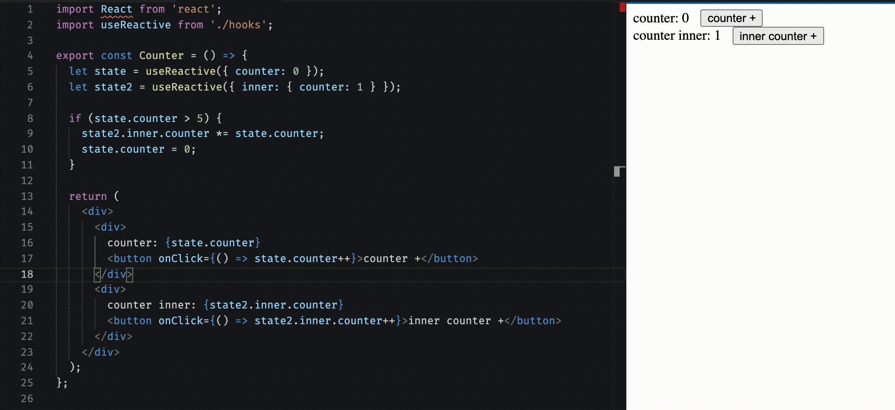
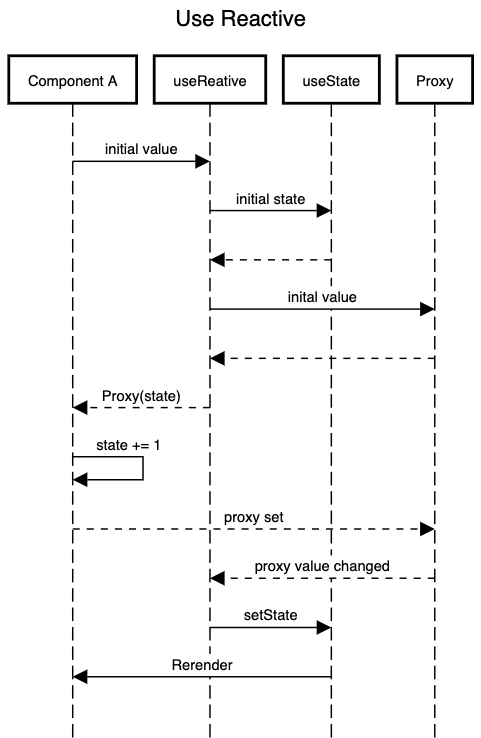

[](https://www.npmjs.com/package/use-reactive-ts)
[](https://www.npmjs.com/package/use-reactive-ts)
[](https://github.com/avipunes/use-reactive-ts/actions/workflows/release.yml)


# Use Reactive TS

React hook for having a mutable state that will be reactive without using `setState`. this hook is provided with TS first approach and performance consideration so it will **not** increase the number of your components renders.



---

## Motivation

React is a treble name for the React lib, as it doesn't react to changes, we tell React, listen we had a change, there is our new state, please change it. But this is not native. Take a minute to think about why `counter++` is not enough to place the new value on the screen.<br>
Now try to think of some production complex state cases where you had to loop and find an object and only then do something to it while you have the object in your hand in the first place! Why not just change it.

This approach is probably not the React/Functional way of handling state changes, but hey, this is more programing language native. Take [Immer](https://immerjs.github.io/immer/) for an example, how easy it is just to change the object you are running on.<br>

A highly recommended [session](https://www.youtube.com/watch?v=AdNJ3fydeao) by [Rich Harris](https://github.com/Rich-Harris) about how React is not reactive by its nature and how that inspired him to write [Svelt](https://github.com/sveltejs/svelte).

---

## How it works

To have all React side effects by rerendering a component, useReactive uses `useState` and `useMemo` to improve memoization.<br>
The following is a sequence diagram which describes the flow of actions to have a reactive state.



---

## Installation

```sh
npm install use-reactive-ts --save
```

## Signature

```typescript
function useReactive<T extends object>(initialState: T): T;
```

---

## Usage

### Simple Counter

```typescript
const Counter = () => {
    let state = useReactive<CounterState>({ counter: 0 });

    if (state.counter > 5) {
        state.counter = 0;
    }

    return (
        <div>
            <div>
                counter: {state.counter}
                <button onClick={() => state.counter++}>counter +</button>
            </div>
        </div>
    );
};
```

### Counter with nested object

```typescript
const Counter = () => {
    let state = useReactive<CounterState>({ inner: { counter: 0 } });

    if (state.inner.counter > 5) {
        state.inner.counter = 0;
    }

    return (
        <div>
            <div>
                counter: {state.inner.counter}
                <button onClick={() => state.inner.counter++}>counter +</button>
            </div>
        </div>
    );
};
```

For more usage, check out [Test Suits](https://github.com/avipunes/use-reactive-ts/tree/main/src/tests) and [Examples](https://github.com/avipunes/use-reactive-ts/tree/main/src/examples).

---

## Test

-   [x] Component is reactive by mutable state changes
-   [x] Number of component renders
-   [ ] Number of complex components tree renders

```sh
npm test
```
